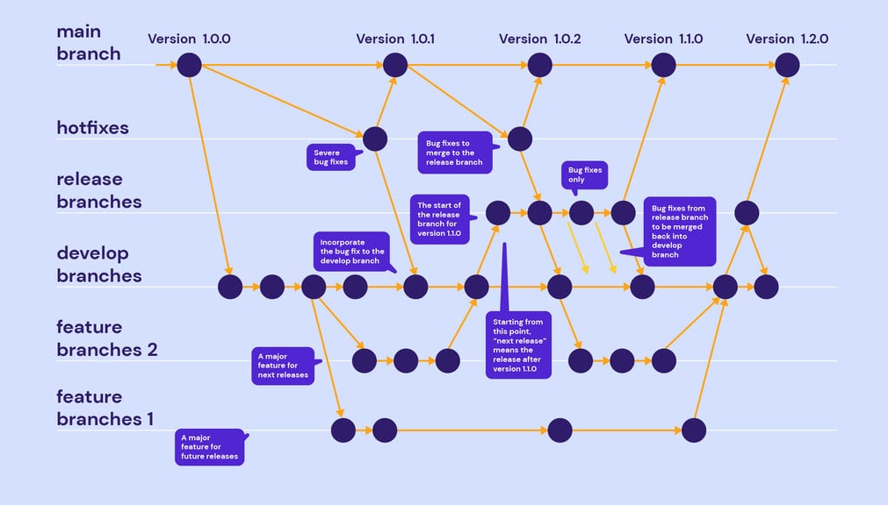

# Learn Git

## Basic
- git init (terminal)
- git status
- git add <'file name'>
- git commit -m 'message'
- git push origin master

- git clone <'link to your repo'>

- git branch
- git fetch (only download all branches (changes) from repo)
- git checkout fix1
- git checkout -b fix2 (create new branch)
- git push origin fix2
- git pull origin fix1  (download all branches with changes)

